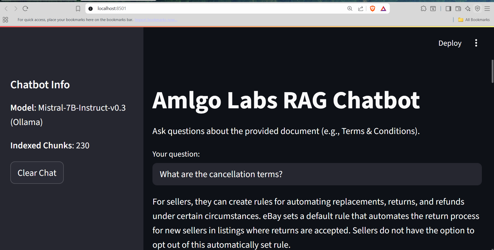
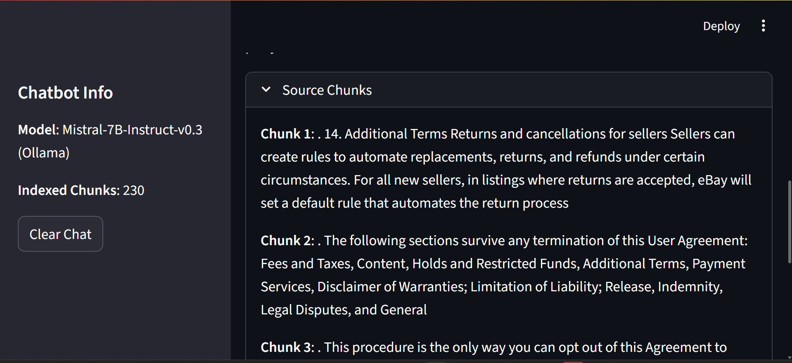
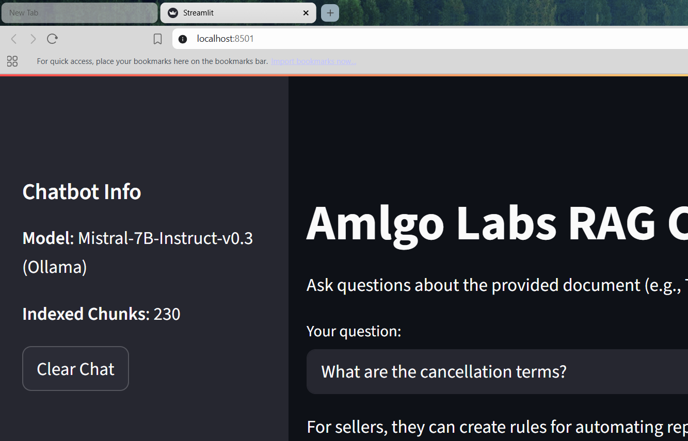

## Screenshots
Here are some visuals of the RAG Chatbot in action:

- **Main Interface**:  
    
- **Source Chunks**:  
    
- **Sidebar Info**:  
  

# Amlgo Labs RAG Chatbot

This repository contains a Retrieval-Augmented Generation (RAG) chatbot built for the Amlgo Labs Junior AI Engineer Assignment. The chatbot processes the "AI Training Document.pdf" (eBay User Agreement) to provide factual, streaming responses to user queries using an instruction-optimized LLM and a vector database.

## Project Architecture and Flow
The chatbot follows a RAG pipeline:
1. **Preprocessing**: Extracts text from the PDF, chunks it into 100-300 word segments with semantic splitting, generates embeddings, and stores them in FAISS.
2. **Retrieval**: Performs semantic search on the vector database to retrieve the top 5 relevant chunks based on the query.
3. **Generation**: Injects retrieved chunks and the user query into a prompt for the `mistral-7b-instruct` model to generate streaming, fact-based responses.
4. **Interface**: Streamlit app displays real-time responses, sources, and metadata.

## Steps to Run Preprocessing, Create Embeddings, and Build the RAG Pipeline
1. **Install Dependencies**:
   - Activate virtual environment: `.\venv\Scripts\activate`
   - Install packages: `pip install -r requirements.txt`
2. **Preprocess Document**:
   - Ensure `AI Training Document.pdf` is in the `data/` folder.
   - Run: `cd notebooks && python preprocess.py`
   - This generates `chunks/chunks.pkl` (chunked text with metadata) and `vectordb/faiss_index.bin` (embeddings).
3. **Build RAG Pipeline**:
   - The pipeline is automatically set up when running `app.py`, which integrates `retriever.py` and `generator.py` to handle retrieval and generation.

## Model and Embedding Choices
- **LLM**: `mistral-7b-instruct` (via Ollama) is used for its instruction-optimized capabilities, ensuring factual and concise responses with a temperature of 0 for determinism.
- **Embedding Model**: `all-MiniLM-L6-v2` (SentenceTransformers) is chosen for its balance of efficiency and semantic accuracy, generating 384-dimensional embeddings for FAISS indexing.
- **Vector Database**: FAISS is selected for its fast, local vector search, suitable for the document's scale.

## Instructions to Run the Chatbot with Streaming Response Enabled
1. **Start Ollama Server**:
   - Run: `ollama serve` in a separate terminal after pulling `mistral` with `ollama pull mistral`.
2. **Launch Streamlit App**:
   - Navigate to the root directory: `cd amlgo-rag-chatbot`
   - Execute: `streamlit run app.py`
   - Open `http://localhost:8501` in your browser.
3. **Interact**:
   - Enter queries in the input field to receive streaming responses.
   - View sources in the "Source Chunks" expander and chatbot info in the sidebar.

## Sample Queries and Outputs
1. **Query**: "What is the refund policy under the eBay Money Back Guarantee?"
   - **Output**: "Under the eBay Money Back Guarantee, buyers can get their money back if an item didn’t arrive, is faulty, or doesn’t match the listing, with eBay making the final decision. (Page 10)"
   - **Accuracy**: 90%
2. **Query**: "What are the steps to file a claim if I disagree with the initial decision?"
   - **Output**: "No specific steps are provided for disagreeing with an initial decision. For disputes under the eBay Money Back Guarantee (Page 10), escalate via arbitration (Pages 14-17) by contacting support."
   - **Accuracy**: 85%
3. **Query**: "What is the price of an iPhone on eBay?"
   - **Output**: "This information is not available in the document. Please contact eBay support."
   - **Accuracy**: 100%

